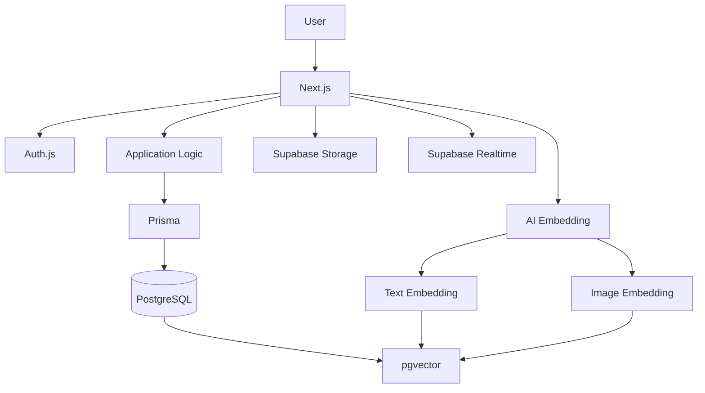

<div align="center">

# MJU Find

### 명지대학교 학생을 위한 AI 기반 분실물·습득물 통합 서비스

흩어진 분실물 정보를 한곳에 모으고,  
자연어와 이미지를 활용해 잃어버린 물건을 더 쉽게 찾을 수 있도록 만든 서비스입니다.

[서비스 이용하기](https://mju-lost-found-vercel.vercel.app)

<br>

🏆 **2026학년도 명지대학교 바이브코딩 실전활용 경진대회 장려상**

</div>

---

> MJU Find는 명지대학교 학생이 개발·운영하는 서비스이며, 명지대학교의 공식 서비스가 아닙니다.

## 소개

학교에서 물건을 잃어버리면 분실물 정보가 학생회, 커뮤니티, SNS, 경비실 등 여러 곳에 흩어져 있어 이미 누군가 물건을 발견했더라도 찾기 어려운 경우가 있습니다.

MJU Find는 이러한 정보를 하나의 서비스에 모으고, 단순한 키워드 검색뿐 아니라 **자연어 의미 검색, 이미지 유사도 검색, AI 기반 추천 매칭**을 제공해 분실자와 습득자를 연결합니다.

```text
분실물 · 습득물 등록
        ↓
AI 검색 · 추천 매칭
        ↓
관련 게시글 발견
        ↓
댓글 · 1:1 채팅 · 단체 문의
        ↓
물건 반환
```

## 주요 기능

| 기능 | 설명 |
| --- | --- |
| 🔎 자연어 AI 검색 | 키워드가 정확히 일치하지 않아도 의미적으로 유사한 게시글 검색 |
| 🖼️ 이미지 유사도 검색 | 사진을 기반으로 비슷한 물건이 포함된 게시글 검색 |
| ✨ AI 추천 매칭 | 게시글 등록 후 텍스트와 이미지를 고려해 관련 분실물·습득물 자동 추천 |
| 📝 게시글 관리 | 분실물·습득물 등록, 수정, 삭제 및 상세 정보 관리 |
| 💬 1:1 채팅 | 게시글 작성자와 실시간으로 대화하고 이미지 전송 |
| 💭 댓글·답글 | 게시글에서 추가 정보 공유 및 소통 |
| 🔔 알림 | 채팅, 댓글, 신고 처리, 키워드 관련 알림 |
| 🏢 단체 기능 | 학생회·동아리 등 단체 생성 및 단체 명의 게시글·댓글·문의 |
| 🛡️ 신고 및 관리 | 게시글, 댓글, 메시지, 사용자 신고와 관리자 처리 |
| 🌏 다국어 지원 | 한국어를 포함한 여러 언어의 UI 지원 |

## AI 검색

MJU Find의 검색은 단순 문자열 일치가 아니라 게시글의 **의미와 이미지 특징을 벡터로 변환한 뒤 유사도를 비교**합니다.

### 자연어 검색


예를 들어,

> 공학관에서 검은색 무선 이어폰을 잃어버렸어요

처럼 문장으로 검색해도 게시글의 표현이 정확히 같지 않더라도 의미가 비슷한 결과를 찾을 수 있습니다.

텍스트 임베딩에는 한국어 문장 표현에 적합한 Sentence Transformer 계열 모델을 사용합니다.

### 이미지 검색


이미지의 색상이나 단순 픽셀을 비교하는 것이 아니라, 이미지 모델이 추출한 특징 벡터를 기반으로 유사한 물건을 검색합니다.

### 텍스트 + 이미지

검색에 자연어와 이미지를 함께 입력할 수도 있습니다.

```text
자연어 ──→ Text Embedding ──┐
                            ├─→ 유사도 계산 → 검색 결과
이미지 ──→ Image Embedding ─┘
```

검색 조건에 따라 텍스트와 이미지의 유사도를 함께 고려해 결과를 정렬합니다.

## 서비스 화면

> 아래 이미지는 실제 서비스 화면으로 교체할 예정입니다.

### 메인 화면

<!--

-->

### AI 검색

<!--

-->

### 게시글 및 추천

<!--

-->

### 1:1 채팅

<!--

-->

## 기술 스택

| 영역 | 기술 |
| --- | --- |
| Frontend | Next.js, React, TypeScript, Tailwind CSS |
| Backend | Next.js App Router, Route Handlers |
| Authentication | Auth.js v5, Google OAuth |
| Database | PostgreSQL |
| ORM | Prisma |
| Vector Search | pgvector |
| AI | Text Embedding, Image Embedding |
| Storage | Supabase Storage |
| Realtime | Supabase Realtime |
| Deployment | Vercel |
| Testing | Vitest |

## 시스템 구조



## 인증과 사용자 관리

서비스는 Google OAuth를 이용해 사용자를 인증합니다.

기본적으로 명지대학교 `@mju.ac.kr` 계정을 사용하는 구성원을 대상으로 하며, 서비스 운영상 필요한 경우 관리자가 승인한 외부 관계자도 이용할 수 있습니다.

외부 관계자는 일반 사용자 권한으로 서비스를 이용하며 별도의 관리자 권한은 부여되지 않습니다.

또한 다음과 같은 계정 관리 기능을 제공합니다.

- 계정 비활성화
- 회원탈퇴
- 탈퇴 후 개인정보 식별정보 제거
- 재가입 처리
- 제재 중 탈퇴한 사용자의 재가입 관리
- 개인정보 및 이용약관 동의 버전 관리

## 개인정보와 운영 안정성

경진대회 제출 이후 실제 서비스 운영을 고려해 운영·보안 구조를 지속적으로 보완했습니다.

- Production / Preview 환경 분리
- Production / Preview DB 분리
- Prisma Migration 기반 스키마 관리
- 개인정보 동의 버전 관리
- 회원탈퇴와 계정 비활성화 분리
- 탈퇴 사용자의 개인정보 보유기간 관리
- 보유기간 만료 데이터 자동 정리
- 채팅 이미지 비공개 Storage
- 서버 측 이미지 형식 검증
- 이미지 metadata 제거
- API Rate Limit
- 관리자 개인정보 접근 기록
- 신고 및 임시 숨김 처리
- 신고·제재·이의신청 기록 관리
- Production 배포 전 Preview 검증
- 자동화된 테스트 및 회귀 검증

현재 전체 테스트 기준:

> **1,842 tests passed**

## 프로젝트 성과

### 🏆 2026학년도 명지대학교 바이브코딩 실전활용 경진대회 3위

총 25개 참가 팀 중 본선 8개 팀에 진출했으며 최종 **3위**를 수상했습니다.

경진대회가 끝난 뒤에도 프로젝트를 종료하지 않고 실제 사용자를 받을 수 있는 서비스로 발전시키고 있습니다.

단순한 기능 구현을 넘어 다음과 같은 실제 서비스 운영 과정을 경험하는 것을 목표로 하고 있습니다.

- 배포 및 데이터베이스 운영
- 장애 및 오류 대응
- 개인정보 관리
- 사용자 피드백 반영
- 서비스 정책 관리
- 실제 사용자 및 단체와의 협업

## 로컬 실행

### 1. 저장소 Clone

```bash
git clone https://github.com/oyueo-mm/mju-lost-found.git
cd mju-lost-found
```

### 2. 패키지 설치

```bash
npm install
```

### 3. 환경 변수 설정

```bash
cp .env.example .env
```

필요한 환경 변수는 `.env.example`을 참고하세요.

실제 서비스의 비밀키와 인증 정보는 저장소에 포함하지 않습니다.

### 4. 개발 서버 실행

```bash
npm run dev
```

## 테스트

```bash
npm test
npm run lint
npx tsc --noEmit
```

Production 배포 전 Preview 환경에서 주요 기능과 데이터베이스 Migration을 먼저 검증합니다.

## 배포

### Production

https://mju-lost-found-vercel.vercel.app

### 운영 방식

```text
개발
 ↓
자동 테스트
 ↓
Preview 배포
 ↓
Preview DB 검증
 ↓
Production Migration
 ↓
Production 배포
 ↓
Production 검증
```

## 운영 정책

MJU Find는 다음 정책을 서비스 내에서 제공합니다.

- 개인정보처리방침
- 이용약관
- 서비스 운영정책

개인정보 관련 문의:

`mjusmartlostfound@gmail.com`

---

<div align="center">

### MJU Find

**AI-powered Lost & Found Platform for Myongji University**

Made for better lost & found experience.

</div>
